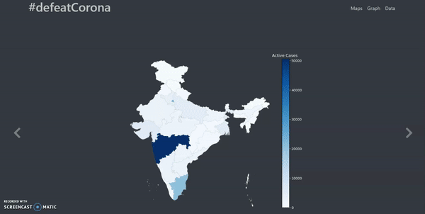

# \#defeatCorona

It is a simple dashboard created to visualize the **Corona** cases in India.
Go visit it at https://defeatcorona.herokuapp.com/

## Maps

There are 3 types of maps shown in this dashboard :

 - Active cases
 - Cured 
 - Deaths 

  

## Graphs

In the graphs section , the user is prompted to chose the states to view the graphs : 

  

## Data
All the data used and displayed in the website was scraped from the website of **[Ministry of Health and Family Welfare](https://www.mohfw.gov.in/)**.

  

